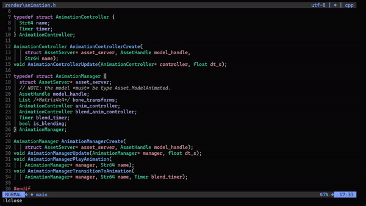

# related_files.nvim

`related_files.nvim` is an unopinionated, lightweight plugin for grouping
together filepaths using regex to allow for easy hopping between files using
location lists.



## Quick start

```lua
-- Lazy.nvim
{
  'mccloskeybr/related_files.nvim'
  keys = {
    {
      '<Leader>r',
      mode = {'n'},
      function()
        require('related_files').open()
      end
    },
  },
  config = function()
    require('related_files').setup({
      config = {
        -- see Opts.
      },
      groups = {
        -- see Groups.
      },
    })
  end
}
```

## Configuration

### Groups

`related_files.nvim` is unopinionated -- there are no default file groups to
lean on. You are expected to manually configure all groups that are useful to
you in order to use it properly.

There are 2 callback functions you are required to define per group:

-   `is_in_group(file_path)`: should return a bool if the given `file_path` is a
    part of this group.
-   `get_files_in_group(file_path)`: should return a list of dicts for all files
    in a group with `file_path`. Elements should adhere to the rules dictated by
    `:help setqflist`. Popular fields to set may be `filename`, `text`.

The name of each group is arbitrary / does not matter.

### Opts

`related_files.nvim` provides the following top-level configuration options:

| opt                 | type       | description                | default |
| ------------------- | ---------- | -------------------------- | ------- |
| `close_on_select`   | `bool`     | Automatically closes the   | `true`  |
:                     :            : location list when an      :         :
:                     :            : element has been selected. :         :
| `stop_on_first_hit` | `bool`     | A single file can map to   | `false` |
:                     :            : multiple groups. If        :         :
:                     :            : `stop_on_first_hit` is     :         :
:                     :            : true, `related_files.nvim` :         :
:                     :            : only matches a single file :         :
:                     :            : to a single group.         :         :
| `format_func`       | `function` | Callback to format each    | `nil`   |
:                     :            : line in the location list. :         :
:                     :            : See `\:help                :         :
:                     :            : quickfix-window-function`. :         :

A single file can map to multiple groups. If `stop_on_first_hit` is true,
`related_files.nvim` only matches a single file to a single group. | `false` |

### Example

```lua
-- dir1/dir2/file.ext --> (dir1/dir2/, file, .ext)
local sep = function(file_path)
  return string.match(file_path, '(.+[\\/])(.+[^%.])(%..+)$')
end

-- displays label :: filename for each related file in a group.
-- in this example, that would be:
-- dir1/dir2/example.h --> header :: example.h
-- dir1/dir2/example.c --> impl :: example.c
-- see :help quickfix-window-function for more info.
local my_format_func = function(info)
  items = vim.fn.getloclist(0, { id = info[id], items = 1 }).items
  l = {}
  for idx = info.start_idx, info.end_idx do
    label = items[idx].text
    file = vim.fn.fnamemodify(vim.fn.bufname(items[idx].bufnr), ':t')
    table.insert(l, label .. ' :: ' .. file)
  end
  return l
end

require('related_files').setup({
  config = {
    close_on_select = true,
    stop_on_first_hit = false,
    format_func = my_format_func,
  },
  groups = {
    c = {
      is_in_group = function(file_path)
        local _, _, ext = sep(file_path)
        if ext == '.h' or ext == '.c' then return true end
        return false
      end,
      get_files_in_group = function(file_path)
        local dir, name, _ = sep(file_path)
        return {
          { filename = dir .. name .. '.h', text = 'header' },
          { filename = dir .. name .. '.c', text = 'impl'   },
        }
      end,
    }
  }
})
```

## Functions

`related_files.nvim` exposes a single function:
`require('related_files').open()`. This will collect all configured related
files for the current file and populate them in a location list associated with
the current buffer.

There is no default keybind. I recommend configuring `<Leader>r`.
